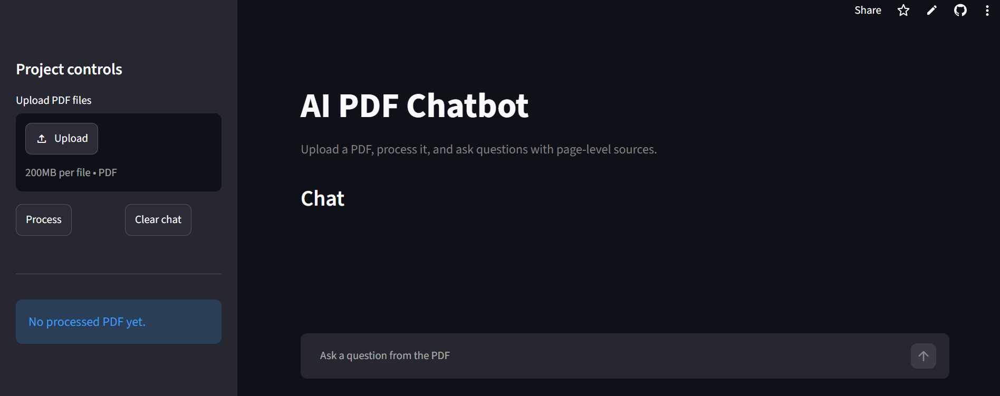
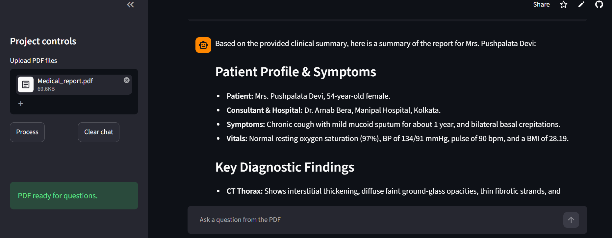
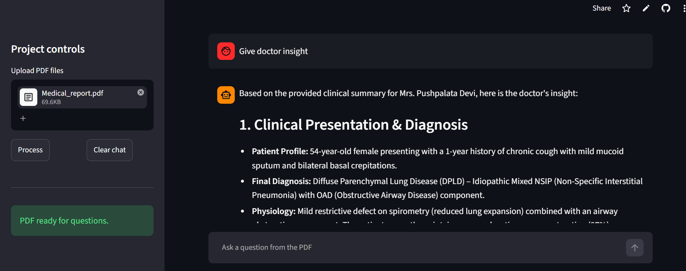

# AI Document Intelligence Assistant & Medical Report Analyzer

An AI-powered Document Intelligence System built using LangChain, Google Gemini, FAISS, and Streamlit.

The application allows users to upload PDF documents, ask questions, generate summaries, retrieve relevant information, and analyze medical reports using Retrieval Augmented Generation (RAG).

---

## Live Demo

🚀 Live Application

https://ai-pdf-chatbot-rag-6kza7q4fntgxp35udzr5aw.streamlit.app/

### What You Can Do

- Upload PDF documents
- Ask questions from uploaded PDFs
- Generate document summaries
- Extract key information
- Analyze medical reports
- Extract patient details
- Generate doctor-friendly insights
- Retrieve source-based answers

---

# Features

## General PDF Analysis

- PDF Upload and Processing
- Intelligent Question Answering
- Document Summarization
- Source-Based Retrieval
- Multi-page PDF Support
- Context-Aware Responses

## Medical Report Analysis

- Patient Information Extraction
- Key Test Value Identification
- Abnormal Finding Detection
- Clinical Impression Generation
- Doctor-Friendly Summaries
- Quick Clinical Insights

---

# Screenshots

## Home Page



## Medical Report Summary



## Doctor Insight



---

# Key Features

✅ Retrieval Augmented Generation (RAG)

✅ Google Gemini Integration

✅ FAISS Vector Database

✅ Semantic Search

✅ Multi-page PDF Processing

✅ Medical Report Analysis

✅ Doctor-Friendly Clinical Summaries

✅ Source-Based Answers

✅ Streamlit Deployment

✅ GitHub Version Control

---

# Technology Stack

## Frontend

- Streamlit

## AI & RAG

- LangChain
- Google Gemini
- FAISS Vector Store

## Document Processing

- PyPDF
- RecursiveCharacterTextSplitter

## Embeddings

- Google Generative AI Embeddings

## Deployment

- Streamlit Cloud
- GitHub

---

# System Architecture

```text
User Uploads PDF
        │
        ▼
Text Extraction (PyPDF)
        │
        ▼
Text Chunking
        │
        ▼
Gemini Embeddings
        │
        ▼
FAISS Vector Database
        │
        ▼
Similarity Search
        │
        ▼
Gemini LLM
        │
        ▼
Answer Generation with Sources
```

---

# Project Workflow

### Step 1: Upload PDF

User uploads one or more PDF documents.

### Step 2: Text Extraction

PyPDF extracts text from all pages.

### Step 3: Chunking

LangChain splits large text into manageable chunks.

### Step 4: Embedding Generation

Google Gemini Embeddings convert text chunks into vectors.

### Step 5: Vector Storage

Vectors are stored in FAISS for fast retrieval.

### Step 6: Question Answering

Relevant chunks are retrieved using semantic similarity search.

### Step 7: Response Generation

Gemini generates accurate answers using retrieved context.

---

# Example Use Cases

## Educational PDFs

- What is velocity?
- Explain displacement.
- Summarize this chapter.
- Extract important concepts.

## Medical Reports

- Summarize this report.
- Extract patient details.
- Show abnormal findings.
- Generate clinical impression.
- Give doctor insights.
- Identify critical values.

---

# Installation

## Clone Repository

```bash
git clone https://github.com/Gautams1990/AI-PDF-Chatbot-RAG.git

cd AI-PDF-Chatbot-RAG
```

## Create Virtual Environment

```bash
python -m venv venv
```

### Activate Environment

Windows

```bash
venv\Scripts\activate
```

Linux / Mac

```bash
source venv/bin/activate
```

## Install Dependencies

```bash
pip install -r requirements.txt
```

## Create Environment File

Create a `.env` file:

```env
GOOGLE_API_KEY=YOUR_GOOGLE_API_KEY
```

## Run Application

```bash
streamlit run app.py
```

---

# Project Highlights

- Built a Retrieval Augmented Generation (RAG) application.
- Implemented semantic document retrieval using FAISS.
- Integrated Google Gemini for answer generation.
- Developed a Medical Report Analyzer capable of generating doctor-friendly summaries.
- Implemented source-grounded responses.
- Successfully deployed on Streamlit Cloud.
- Managed version control using Git and GitHub.

---

# Resume Project Description

### AI Document Intelligence Assistant & Medical Report Analyzer

Developed an AI-powered document intelligence system using LangChain, Google Gemini, FAISS, and Streamlit.

Implemented Retrieval Augmented Generation (RAG) to enable intelligent PDF question answering, semantic search, document summarization, and medical report analysis. The system retrieves relevant document context using vector embeddings and generates accurate responses through Gemini Large Language Models.

---

# Future Enhancements

- OCR Support for Scanned PDFs
- Multi-Document Comparison
- Chat Memory
- PDF Summary Export
- Medical Risk Scoring
- Healthcare Dashboard
- Voice-Based Querying
- Citation Highlighting
- Multi-Language Support

---

# Repository

GitHub Repository:

https://github.com/Gautams1990/AI-PDF-Chatbot-RAG

---

# Author

## Gautam Sharma

Mechanical Engineering Graduate | Physics Educator | Aspiring AI Engineer

GitHub:
https://github.com/Gautams1990

---

## If You Like This Project

⭐ Star the repository

🍴 Fork the repository

🚀 Connect and collaborate
